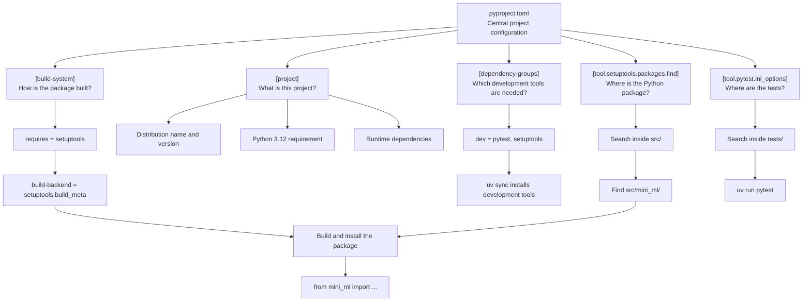
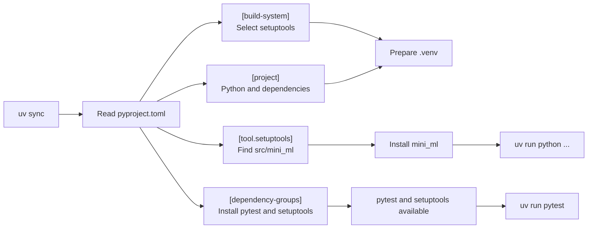

# Week 01 — Build Your First Installable Python Package

## Learning Goals

This week begins with software foundations rather than a machine-learning formula. You will create one installable Python package that continues growing throughout the ten-week workshop. By the end of the session, you should be able to:

1. Create a Python 3.12 environment with uv.
2. Build a src-layout package by hand inside `students/<name_studentnumber>/`.
3. Install your package in editable mode.
4. Import `hello_world()` from outside the package and print its result.
5. Run your first unit test, open your first PR, and inspect its CI result.

AI may help you create a file skeleton, but you must be able to explain the purpose of every file and correct the code until both local tests and CI pass.

## Before Class

- [ ] Create a GitHub account, join `Stat-ML-Python-Workshop`, and accept Write access to the repository.
- [ ] Install Git and confirm that `git --version` works in a terminal.
- [ ] Install uv and confirm that `uv --version` works in a terminal.
- [ ] Configure your Git name and email.
- [ ] Install an IDE. Antigravity is recommended, but VS Code or another IDE is also acceptable.
- [ ] Git Graph is recommended. Use your IDE's built-in Markdown preview for lesson files.

Antigravity and any educational offer are optional and do not affect course acceptance.

## Step 1: Create Your Branch and Student Folder

Replace `<login>` with your GitHub login and `<folder>` with the `name_studentnumber` folder registered by the instructor.

```sh
git clone https://github.com/Stat-ML-Python-Workshop/python-workshop.git
cd python-workshop
git switch -c <login>/week-01
mkdir -p students/<folder>
cd students/<folder>
```

Confirm that your current branch is `<login>/week-01`. Never work directly on `main`.

## Step 2: Run Your First Python File

Create `test_code/python_basics.py`:

```python
language = "Python"
print("Hello from", language)
```

```sh
mkdir -p test_code
uv run --no-project --python 3.12 python test_code/python_basics.py
```

Change `language` to your own name and run the file again. Observe variables, strings, `print()`, and the edit-run feedback loop. Later weeks will introduce additional syntax as it becomes useful.

## Step 3: Create Your Environment

```sh
uv venv --python 3.12
uv pip list
```

`.venv` is the isolated environment for this student package. Anaconda and conda can also manage environments, but this workshop uses uv consistently so that one project does not mix two environment managers.

## Step 4: Create the Codebase Structure

Create the following structure by hand in your IDE. The later `uv lock` command generates `uv.lock`; do not write it manually. Keep `test_code/` local and do not commit it.

```text
students/<name_studentnumber>/
├── .gitignore
├── README.md
├── pyproject.toml
├── uv.lock                  # generated by uv
├── src/
│   └── mini_ml/
│       ├── __init__.py
│       └── greetings.py
├── tests/
│   └── test_greetings.py
└── test_code/
    └── try_package.py
```

`pyproject.toml`:

```toml
[build-system]
requires = ["setuptools>=75,<81"]
build-backend = "setuptools.build_meta"

[project]
name = "workshop-mini-ml"
version = "0.1.0"
requires-python = ">=3.12,<3.13"
dependencies = []

[dependency-groups]
dev = [
    "pytest>=8.3,<9",
    "setuptools>=75,<81",
]

[tool.setuptools.packages.find]
where = ["src"]

[tool.pytest.ini_options]
testpaths = ["tests"]
```

### How `pyproject.toml` is organized



### What happens when `uv sync` runs



The key distinction is that `[project]` describes package metadata and dependencies; it does not discover the folder structure. The `[tool.setuptools.packages.find]` section tells setuptools to find `mini_ml` inside `src/`.

`.gitignore`:

```gitignore
.venv/
__pycache__/
.pytest_cache/
*.pyc
*.egg-info/
test_code/
```

Your `README.md` must include the package name, what you completed this week, and the command used to run the tests.

## Step 5: Create Your First Public API

Create `src/mini_ml/greetings.py`, `src/mini_ml/__init__.py`, and `tests/test_greetings.py` in that order. You may type the lesson code, copy and paste it, or ask AI to create the skeleton, but check every line yourself.

`src/mini_ml/greetings.py`:

```python
def hello_world() -> str:
    return "Hello, world!"
```

`src/mini_ml/__init__.py`:

```python
from .greetings import hello_world

__all__ = ["hello_world"]
```

`tests/test_greetings.py`:

```python
from mini_ml import hello_world

def test_hello_world():
    result = hello_world()
    assert result == "Hello, world!"
```

`hello_world()` returns data; the calling program decides whether to print it. This makes the function reusable from a terminal script, a test, or another program.

Create `test_code/try_package.py`:

```python
from mini_ml import hello_world

print(hello_world())
```

## Step 6: Install and Run the Package

```sh
uv pip install -e .
uv lock
uv sync --frozen
uv run python test_code/try_package.py
```

Expected output:

```text
Hello, world!
```

- `uv pip install -e .` demonstrates an editable installation: changes under `src/mini_ml/` become available without copying or reinstalling the package after every edit.
- `uv sync` is the routine command used in later weeks to align the environment with `pyproject.toml` and `uv.lock`.

## Step 7: Run Your First Unit Test

Temporarily change the expected value in the test so that it is wrong, then run:

```sh
uv run pytest
```

Read the expected and actual values in the failure message. Correct the test and run it again until it passes. Commit unit tests under `tests/`; keep local experiments under `test_code/`.

## Step 8: Submit Your First PR

```sh
git status
git add students/<folder>
git commit -m "Complete week 01 package setup"
git push -u origin <login>/week-01
```

Use the PR title `[Week 01] <login>`. If CI fails, correct the same branch and push again; do not open another PR.

## GitHub Actions, Docker, and CI

```text
Student push
    ↓
Pull request update
    ↓
GitHub Actions starts
    ↓
Validate account, branch, week, and changed paths
    ↓
Create an isolated Docker container
    ↓
Run instructor acceptance tests
    ↓
Report Passed or Failed
```

- GitHub Actions coordinates the automated acceptance workflow.
- A Docker image describes the standard test environment; a container is the temporary environment created for each CI run.
- You do not need to install Docker or learn Dockerfile syntax in Week 1.
- This workshop currently uses continuous integration for automated testing, not continuous deployment.

## Acceptance Criteria

- Use the branch `<GitHub login>/week-01` and modify only your own `students/<name_studentnumber>/` directory.
- Commit `uv.lock`, the package source, and `tests/test_greetings.py`; do not commit `test_code/`.
- The package installs and imports from outside its source directory, `hello_world()` returns `Hello, world!`, and both local pytest and trusted CI pass.
- The reference solution is released on Thursday evening. Completion is based on the latest PR commit passing CI by Friday; instructor review and merge may happen later.
